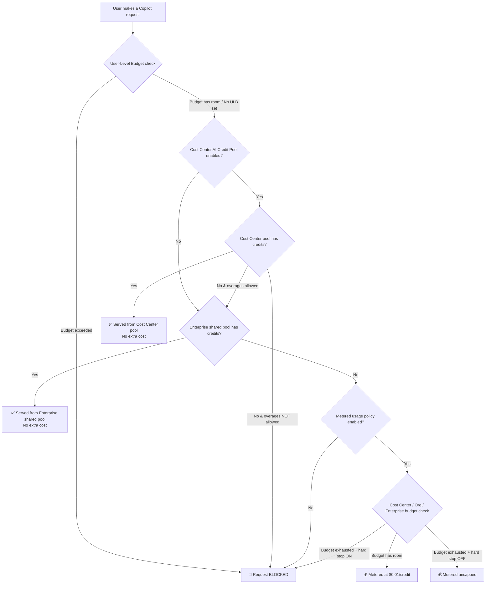
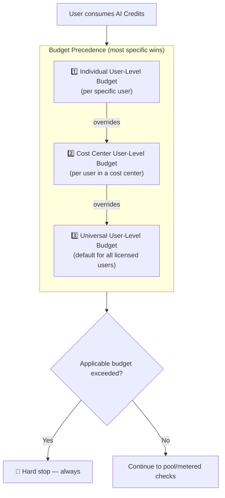
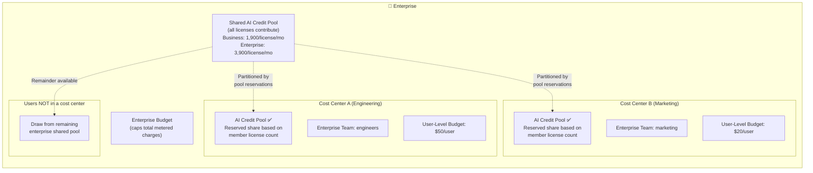
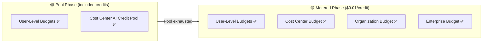
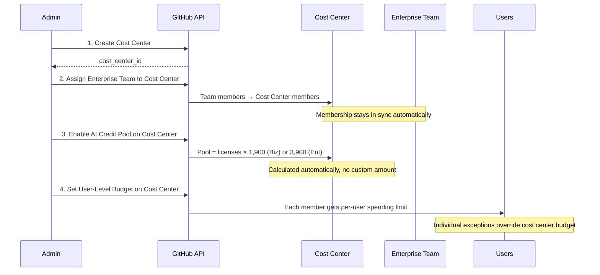

# GitHub Copilot AI Credit Budget Coach

Helpers and simulation tools to help you understand and set up the right configuration for your GitHub Enterprise AI Credit Budgets.

## How AI Credit Budgets Work

GitHub Copilot Enterprise/Business licenses include a shared pool of AI Credits. Budget controls govern how individual users draw from that pool and cap spending once it's exhausted.

### Budget Evaluation Flow

When a user makes a Copilot request that consumes AI Credits, the system evaluates controls in this order:



### User-Level Budget Precedence

User-level budgets (ULBs) are the **only** control active during both the pool phase and metered phase. They always enforce a hard stop.



### Enterprise Structure with Cost Centers & Pool Reservations



### What Each Control Caps and When



### Key Interactions & Gotchas

| Scenario | What happens |
|----------|-------------|
| User hits ULB but cost center budget has room | **User is blocked.** ULB is a total cap across both phases. |
| Enterprise budget exhausted but user's ULB has room | If pool credit remains, **Next Call** is served; otherwise it is blocked (if hard stop is on). |
| Cost center pool exhausted mid-month | If overages allowed → falls through to enterprise pool/metered. If not → user blocked. |
| Pool enabled mid-month | Not retroactive. Users share only what remains of their calculated pool from that point forward. |
| User in no cost center | Draws from the full shared enterprise pool (no reservation). |
| Usage exactly fills a shared hard-stop budget | The acting user's **Last Call** is metered; **Next Call** is blocked for the scope. Enterprise members with pool headroom can still be served. |
| A later action attempts to exceed a shared hard-stop budget | The acting user's **Last Call** is blocked. Other members keep their actual Last Call, while **Next Call** is blocked for the scope. |

### Recommended Setup (3 Controls Together)



## Further Reading

- [Budgets for usage-based billing](https://docs.github.com/en/enterprise-cloud@latest/copilot/concepts/billing/budgets-for-usage-based-billing)
- [Getting started with budget controls](https://docs.github.com/en/enterprise-cloud@latest/copilot/tutorials/budgets/getting-started-with-budget-controls)
- [Optimizing your budget configuration](https://docs.github.com/en/enterprise-cloud@latest/copilot/tutorials/budgets/optimizing-your-budget-configuration)
- [About cost centers](https://docs.github.com/en/enterprise-cloud@latest/billing/using-the-new-billing-platform/about-cost-centers)

## 🧪 Budget Simulator

An interactive web-based tool to help administrators test and visualize budget configurations before deploying them.

**[Open the Simulator →](https://philess.github.io/ghcp_ai_budget_coach/)**

Each user has two simulation statuses. **Last Call** records the actual outcome
of that user's latest simulated consumption and is not rewritten by another
user's later action. **Next Call** projects one additional credit from the final
shared pool and budget state. A cost-center or organization hard stop blocks
Next Call for every member. An exhausted enterprise budget still permits calls
served by remaining pool credit. An action that exceeds available headroom is
blocked for both statuses; an action that exactly fills it remains metered.

In the result table, **Last Call Details** sits beside **Last Call**. The
consumption control shows the effective total ULB inline as `/total` in the
selected unit, or `/∞` when the user has no applicable ULB.

Features:
- Configure enterprise settings (Business/Enterprise seat counts, derived AI credit pool, metered overage policy)
- Create cost centers with AI credit pools and budget caps
- Add sample users with user-level budget precedence (individual > cost center > universal)
- Visualize pool partitions across cost centers
- Simulate per-user consumption with distinct actual **Last Call** and projected **Next Call** outcomes
- Simulate aggregate pool/overage consumption
- Consume cost-center/enterprise pools and metered usage in FIFO order; scope hard stops freeze every member's Next Call without rewriting earlier Last Calls
- Save/load configurations (localStorage + JSON export/import)

### Running the tests

The complete strategy and scenario matrix are documented in
**[TESTS.md](TESTS.md)**.

Run the calculation/unit tests:

```bash
npm test
```

Run the Playwright end-to-end tests in headless Chromium:

```bash
npx playwright install chromium
npm run test:e2e
```

Run both suites:

```bash
npm run test:all
```

For interactive browser troubleshooting, use `npm run test:e2e:headed` or
`npm run test:e2e:debug`.

Pull requests from branches in this repository receive an automatically updated
**Simulator Test Results** comment and GitHub Check combining the unit and
Playwright suites. The workflow also uploads JUnit XML and the Playwright HTML
report on every run; failed runs retain traces, screenshots, and videos for
diagnosis.
